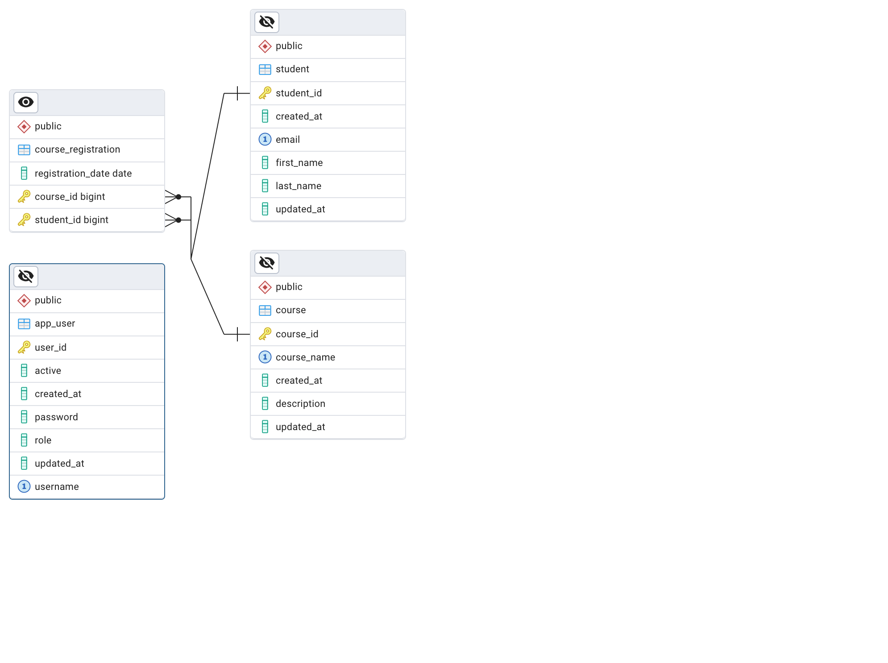

# Student Management System
## Overview
- This Student Management System is a Spring Boot-based application designed for Admin users to manage students and courses.
- Admins can perform CRUD operations on both students and courses, assign students to courses, and export reports as PDFs.
- The system is secured using JWT-based Spring Security.

## Features
### Admin Features
1. Student Management
    - Add, edit, and delete students.
    - Export the list of courses a student is enrolled in as a PDF.
2. Course Management
    - Add, edit, and delete courses.
    - Export the list of students enrolled in a course as a PDF.
3. Student-Course Enrollment
    - Enroll a student in a course.
    - Unregister a student from a course.
4. Request Validation
5. Security
6. Spring Cache
   - Cache frequently accessed data.
7. API Documentation
    - Swagger UI for API exploration and testing.
## Database Design
- The system uses a relational database to store details of users, students, courses, and course registrations.

## Technologies Used
- Spring Boot 3.4, Spring Security
- iText for generating PDFs
- PostgreSQL for development database
- Oracle for test database
- Spring Cache for caching frequently accessed data

## API Endpoints
### Public Endpoints:
- /api/auth/register  ->  `REQUEST_BODY: {username,password}`
    - Success `CREATED: 201`
    - Failed : `CONFLICT: 409` , `BAD_REQUEST: 400` 
- /api/auth/login  ->  `REQUEST_BODY: {username,password}`
    - Success `Ok: 200` with user token info
    - Failed : `UNATHOURIZED: 403` , `BAD_REQUEST: 400` 
### Secured Endpoints: 
- All other endpoints require authentication and appropriate roles.
    #### Students API
    - POST /api/students: Add a new student ->  `REQUEST_BODY: {firstName,lastName,email}`
        - Success `CREATED: 201`
        - Failed : `CONFLICT: 409` , `BAD_REQUEST: 400`
    - PUT /api/students/{id}: Update student details  -> `REQUEST_BODY: {firstName,lastName}` 
        - Success `OK:200`
        - Failed : `CONFLICT: 409` , `BAD_REQUEST: 400`
    - GET /api/students/{id}: Get a specific student by ID 
    - DELETE /api/students/{id}: Delete a student
        - Success `NO_CONTENT:204`
        - Failed : `CONFLICT: 409`
    - GET /api/students/{id}/courses/pdf: Export the courses the student is enrolled in as a PDF
    ### Courses API
    - POST /api/courses: Add a new course ->  `REQUEST_BODY: {courseName,description}`
        - Success `CREATED: 201`
        - Failed : `CONFLICT: 409` , `BAD_REQUEST: 400`
    - PUT /api/courses/{id}: Update course details ->  `REQUEST_BODY: {courseName,description}`
        - Success `OK:200`
        - Failed : `CONFLICT: 409` , `BAD_REQUEST: 400`
    - DELETE /api/courses/{id}: Delete a course
        - Success `NO_CONTENT:204`
        - Failed : `CONFLICT: 409`
    - GET /api/courses: Get a list of all courses
    - GET /api/courses/{id}: Get details of a specific course
        - Success `OK:200`
        - Failed: `NOT_FOUND: 404`
    - GET /api/courses/{id}/students/pdf: Export the list of students enrolled in a course as a PDF
    ### Course Registration API
    - POST /api/courses/{courseId}/students/{studentId}: Enroll a student in a course
        - Success `CREATED: 201`
        - Failed : `CONFLICT: 409` , `BAD_REQUEST: 400`
    - DELETE /api/courses/{courseId}/students/{studentId}: Unregister a student from a course
        - Success `NO_CONTENT:204`
        - Failed : `CONFLICT: 409`,  `NOT_FOUND: 404`

## Security
The application uses Spring Security and JWT for secure authentication and authorization.

## Setup Instructions

1. ## Clone the repository:
    - `git clone https://github.com/romanylabeeb/student-management-system.git`
    
2. ## Install dependencies:
    - `mvn clean install`
3. ## Set up your database (PostgreSQL or Oracle).
    
    - Configure your database in application.properties:
        - properties
            `spring.datasource.url=jdbc:postgresql://localhost:5432/student_management
            spring.datasource.username=your_db_user
            spring.datasource.password=your_db_password` 
    
 4. Run the application: `mvn spring-boot:run`
